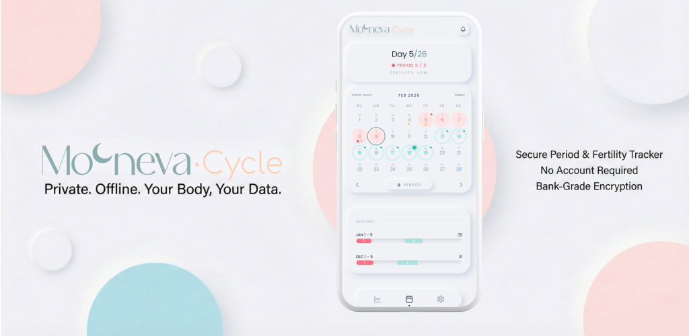
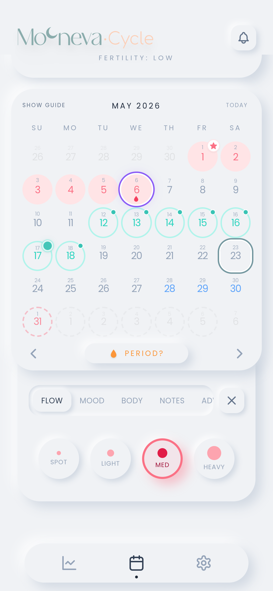
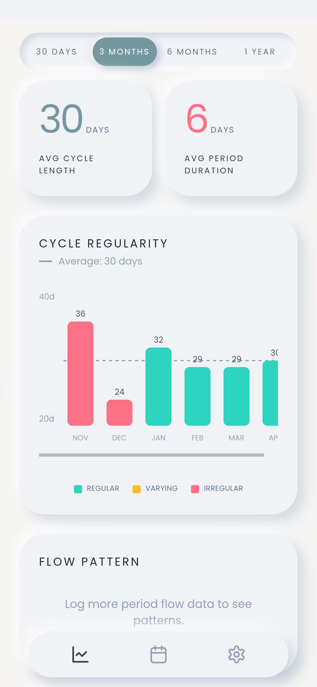
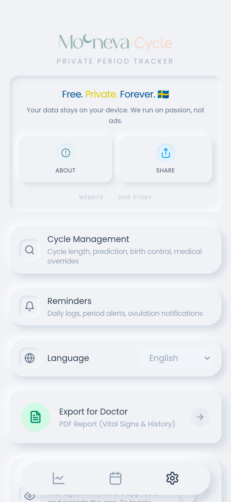
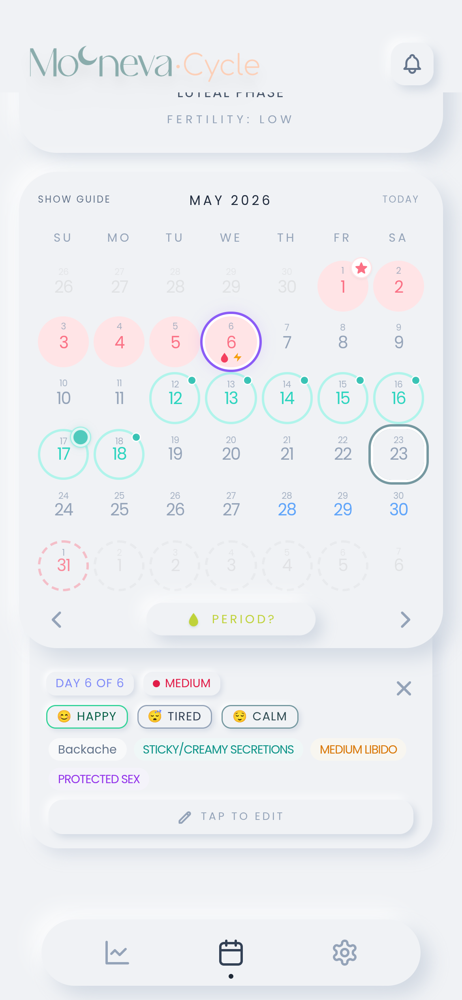

<div align="center">
  
  <h1>Mooneva Cycle</h1>
  <p><strong>Private, offline period & cycle tracker — no account, no cloud, no compromise.</strong></p>

  <a href="https://play.google.com/store/apps/details?id=com.mooneva.app&pcampaignid=web_share">
    
  </a>
  &nbsp;
  <a href="https://apps.apple.com/us/app/mooneva-cycle/id6761208425">
    
  </a>
  &nbsp;
  <a href="https://f-droid.org/en/packages/com.mooneva.app/">
    
  </a>
  &nbsp;
 

  <br /><br />

  
  
  
</div>

---

## Why offline-first?

Most period trackers upload your data to corporate servers — data that has been sold to advertisers, exposed in breaches, and in some jurisdictions legally demanded by law enforcement. Mooneva is built on a different premise: **data that never leaves your device cannot be leaked or subpoenaed.**

There are no Mooneva servers. Your cycle data is encrypted on your device using PBKDF2/AES-GCM and never leaves it. The app requires no internet permission whatsoever — no health data is ever transmitted anywhere. If someone filed a legal request for user data, there would be nothing to hand over — not because we deleted it, but because we never had it.

---



---

## Screenshots

<div align="center">
  
  
  
  
</div>

---

## About

Mooneva Cycle is developed by **[Mooneva](https://mooneva.se/)**, a Swedish femtech company dedicated to building thoughtful tools for women's health. Learn more at [mooneva.se/pages/mooneva_cycle](https://mooneva.se/pages/mooneva_cycle).

All your cycle data stays on your device. No server ever sees it.
 
---

## Features

- **Cycle & period tracking** with smart predictions
- **Fertile window & ovulation** estimates
- **Daily log** — mood, symptoms, flow intensity, discharge
- **PMS window** warnings
- **Trends & history** across multiple cycles
- **Clinical report** export (PDF)
- **Discrete mode** — disguises the app icon and name
- **PIN lock** with configurable timeout
- **Reminder notifications** (period, ovulation, daily log, PMS, Pill)
- **Birth control mode** — hides fertile window, tags bleeds as withdrawal
- **No data transmission** — no internet permission declared, no health data ever leaves the device

---

## Privacy

Mooneva Cycle collects no data. There are no analytics, no crash reporters, no third-party SDKs that phone home. Everything you log stays on your device, encrypted in local storage.

| Cloud-based trackers | Mooneva |
|---|---|
| Data stored on company servers | Data stored only on your device |
| Vulnerable to breaches | No server exists to breach |
| Subject to legal subpoenas | No centralised data to subpoena |
| Requires account with personal info | No account, no registration |
| Company can analyse your data | We cannot see your data — ever |

---

## Building from Source

### Requirements

- Node.js 20+
- npm
- Android Studio (for Android) / Xcode (for iOS)

### Steps

```bash
# Install dependencies
npm install

# Run in browser
npm run dev

# Build web assets
npm run build

# Sync and open Android
npx cap sync android
npx cap open android

# Sync and open iOS
npx cap sync ios
npx cap open ios
```

---

## License

Licensed under the [GNU General Public License v3.0](LICENSE).

Any modified version you distribute must also be open-sourced under GPL-3.0.

---

## Links

- Website: [mooneva.se](https://mooneva.se/)
- App page: [mooneva.se/pages/mooneva_cycle](https://mooneva.se/pages/mooneva_cycle)
- Google Play: [com.mooneva.app](https://play.google.com/store/apps/details?id=com.mooneva.app&pcampaignid=web_share)
- App Store: [Mooneva Cycle](https://apps.apple.com/us/app/mooneva-cycle/id6761208425)
- Issue tracker: [GitHub Issues](https://github.com/aradar46/Mooneva-Cycle-Private-Period-Tracker/issues)

---

## Release Log

### 2.0.4
- Fixed a timezone bug where dates in the PDF clinical report (including registered sex logs) could appear one day earlier than the calendar.

### 2.0.3
- Fixed the F-Droid build by removing the proprietary in-app-review plugin from the public build (Play Store build is unaffected).
- Pinned Capacitor core/android/ios/cli to 8.4.1 to stop version drift.

### 2.0.2
- Added a first-day-of-week setting so calendars can start on Monday, Sunday, or Saturday independent of app language.
- Added pill time logging with editable 24-hour times, calendar/preview badges, backup support, and clinical report output.
- Added the pill logged marker to the calendar guide.
- Moved advanced period options under the Flow tab and kept them visible but disabled until a period day is selected.
- Fixed trend heatmaps so mood and symptom row headers stay visible while scrolling across cycle days, including RTL layouts.

---

## Roadmap

### In progress
- fixing bugs and tweak user friendliness
- dark theme

### Planned
- Zero-knowledge cross-device sync — encrypted client-side,
  server sees only opaque blobs. Device pairing via QR code
  and ECDH key exchange. Opt-in and sandboxed so the
  zero-internet-permission guarantee holds for users who
  skip it.
- Import and migrate data from other period and cycle tracking apps

Have a feature request? Open an [issue](https://github.com/aradar46/Mooneva-Cycle-Private-Period-Tracker/issues) and let us know.

---

## Support the project

Mooneva Cycle is free, open source, and built without any VC funding or commercial data model. If it is useful to you, the best things you can do are:

- Leave a review on [Google Play](https://play.google.com/store/apps/details?id=com.mooneva.app) or the [App Store](https://apps.apple.com/us/app/mooneva-cycle/id6761208425)
- Star the repo
- Report bugs or suggest features via [GitHub Issues](https://github.com/aradar46/Mooneva-Cycle-Private-Period-Tracker/issues)
- Share it with anyone who cares about health data privacy
