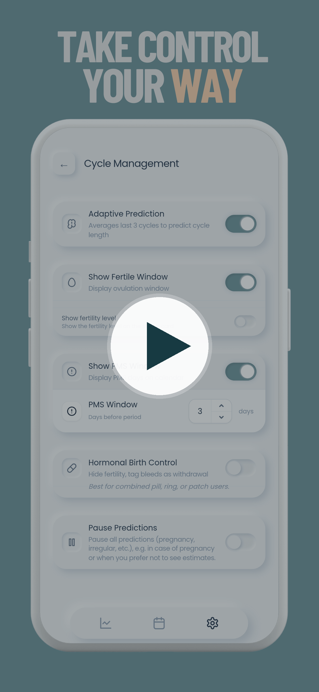

<div align="center">
  
  <h1>Mooneva Cycle</h1>
  <p><strong>Open source, offline period and cycle tracker for Android and iOS. No account, no cloud, no internet permission.</strong></p>

  <a href="https://play.google.com/store/apps/details?id=com.mooneva.app&pcampaignid=web_share">
    
  </a>
  &nbsp;
  <a href="https://apps.apple.com/us/app/mooneva-cycle/id6761208425">
    
  </a>
  &nbsp;
  <a href="https://f-droid.org/en/packages/com.mooneva.app/">
    
  </a>

  <br />

  
  
  
  <a href="https://reports.exodus-privacy.eu.org/en/reports/773571/">
    
  </a>
</div>

<div align="center">
<table>
<tr><td align="center">

### Star this repo to keep it findable

**No ads. No trackers. No investors.** Its rivals sell the data it refuses to collect.

<a href="https://github.com/aradar46/Mooneva-Cycle-Private-Period-Tracker">
  
</a>

</td></tr>
</table>

  
</div>

## Why offline-first?

Most period trackers upload your data to corporate servers, data that has been sold to advertisers, exposed in breaches, and in some jurisdictions legally demanded by law enforcement. Mooneva Cycle is built on a different premise: **data that never leaves your device cannot be leaked or subpoenaed.**

There are no Mooneva servers. Your cycle data is encrypted on your device using PBKDF2 and AES-GCM and never leaves it. The app declares no internet permission at all, so the operating system itself blocks any transmission of health data. If someone filed a legal request for user data, there would be nothing to hand over, not because we deleted it, but because we never had it.

| Cloud-based trackers                | Mooneva Cycle                   |
| ----------------------------------- | ------------------------------- |
| Data stored on company servers      | Data stored only on your device |
| Vulnerable to breaches              | No server exists to breach      |
| Subject to legal subpoenas          | No centralised data to subpoena |
| Requires account with personal info | No account, no registration     |
| Company can analyse your data       | We cannot see your data, ever   |

There are no analytics, no crash reporters, and no third-party SDKs that phone home. The threat model, exact crypto parameters, full permission list, and known limitations are documented in [SECURITY.md](SECURITY.md), which is also where vulnerabilities should be reported rather than as a public issue.

## Screenshots and demo

<div align="center">
  <a href="https://github.com/user-attachments/assets/2ae076d8-84af-4258-b0a4-16b5ff9aa081"></a>
  
  
  
  
</div>

## Features

- **Cycle and period tracking** with smart predictions
- **Fertile window and ovulation** estimates
- **Daily log**: mood, symptoms, flow intensity, discharge, medications
- **PMS window** warnings
- **Trends and history** across multiple cycles
- **Pregnancy logging**: mark the start, the span is shown on the calendar and named in your history and clinical report
- **Clinical report** export (PDF) over a date range you choose
- **Automatic encrypted backups** to a folder you choose, at most once a day, entirely on-device
- **Kid mode**: hides Sex and Libido everywhere, including the exported report
- **Discrete mode**: disguises the app icon and name
- **PIN lock** with configurable timeout
- **Reminder notifications** (period, ovulation, daily log, PMS, pill)
- **Contraception reminders**: pill, patch, ring, injection, IUD, implant
- **Birth control mode**: hides fertile window, tags bleeds as withdrawal
- **Pill tracking**: log intake time, see adherence per cycle day in Trends
- **Dark theme**
- **Data import** from drip, Flo, and Clue
- **14 languages**: English, German, Spanish, Swedish, Chinese, Persian, Arabic, Turkish, French, Ukrainian, Italian, Hungarian, Russian, Portuguese
- **Persian (Jalaali) calendar** and full RTL support for Persian and Arabic

## Building from source

Requires Node.js 20 or later, npm, and Android Studio or Xcode for the native builds.

```bash
npm install          # install dependencies
npm run dev          # run in browser
npm run build        # build web assets

npx cap sync android && npx cap open android
npx cap sync ios     && npx cap open ios
```

## Roadmap

In progress: fixing bugs, tweaking usability, and adding more languages.

Planned: opt-in, zero-knowledge cross-device sync. It would be encrypted client-side and sandboxed so the zero-internet-permission guarantee holds unchanged for anyone who skips it, with device pairing over QR code and ECDH key exchange, and a server that only ever sees opaque blobs.

Have a feature request? [Open an issue](https://github.com/aradar46/Mooneva-Cycle-Private-Period-Tracker/issues).

## Contributing

Translations so far come from [@octantblow](https://github.com/octantblow) (French), [@reginanka](https://github.com/reginanka) (Ukrainian), and [@pihentagy](https://github.com/pihentagy) (Hungarian).

Mooneva Cycle is free, open source, and built without VC funding or a commercial data model. If it is useful to you, the most helpful things are to star the repo, share it with anyone who cares about health data privacy, help get the app into privacy-focused listings, [report a bug or suggest a feature](https://github.com/aradar46/Mooneva-Cycle-Private-Period-Tracker/issues), or leave a review on [Google Play](https://play.google.com/store/apps/details?id=com.mooneva.app) or the [App Store](https://apps.apple.com/us/app/mooneva-cycle/id6761208425).

## Links

- Website: [mooneva.se](https://mooneva.se/) and the [Mooneva Cycle app page](https://mooneva.se/pages/mooneva_cycle)
- Install: [Google Play](https://play.google.com/store/apps/details?id=com.mooneva.app), [F-Droid](https://f-droid.org/packages/com.mooneva.app/), [App Store](https://apps.apple.com/us/app/mooneva-cycle/id6761208425)
- [Version history](CHANGELOG.md) and [security policy](SECURITY.md)
- [Issue tracker](https://github.com/aradar46/Mooneva-Cycle-Private-Period-Tracker/issues)

## About

Mooneva Cycle is developed by **[Mooneva](https://mooneva.se/)**, a Swedish femtech company building thoughtful tools for women's health. On how this project uses AI: [what I delegate to AI, and what I don&#39;t](https://aradar.top/posts/what-i-delegate-to-ai-and-what-i-dont/).

Copyright (C) 2026 Måneva AB. Licensed under the [GNU General Public License v3.0 or later](LICENSE). Any modified version you distribute must also be open-sourced under GPL-3.0-or-later.
